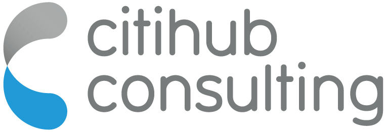

# Compliance as Code

----

The code in this repository supports the examples outlined in the Citihub Whitepaper *"Continuous Compliance as Code in the Cloud"*, available at [https://www.citihub.com/insights/whitepapers/continuous-compliance-as-code-in-the-cloud-citihub-consulting/](https://www.citihub.com/insights/whitepapers/continuous-compliance-as-code-in-the-cloud-citihub-consulting/).

----

## What is this?
In this repository, we showcase some examples of an approach to compliance that we have found to be successful, namely we:

1. Define an abstracted set of common control *objectives* that can be traced back to an origin (a regulation or industry benchmark)
1. Express control *requirements*, implementing these objectives as Behaviour Driven Development (BDD) feature specs using the [Gherkin](https://cucumber.io/docs/gherkin/) DSL
1. Using [Terraform](https://www.terraform.io), deploy a clean-room infrastructure in which to test the controls
1. Test the implementation of BDD features using [Cucumber](https://cucumber.io), specifically the [Godog](https://github.com/cucumber/godog) framework

## Support

For more detail and more examples, or if you have questions, please [get in touch](mailto:enquiries@citihub.com).